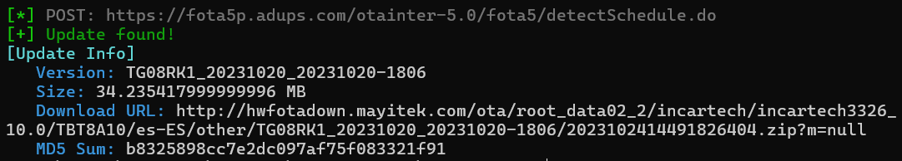

This repository contains:
* `adups_search_updates.py`: A script that can search for new updates.
* `original_apk`: The decompiled original APK that searches for updates on the stock ROM.
* `project`: A Java project with code grabbed from the original APK. It can generate the data sent in the POST request to search for updates. This is no longer needed, use the Python script.

### Searching, downloading & applying updates
* To search for updates, use the `adups_search_updates.py` script (note that it requires the `tbm13_utils` package).
    * It'll search updates for the `TBT8A10` tablet, but you can use it for other devices by changing its variables to match your device's props
    ```python
    RO_FOTA_OEM = 'incartech3326_10.0'
    RO_FOTA_DEVICE = 'TBT8A10'
    RO_PRODUCT_LOCALE = 'es-ES'
    RO_OPERATOR_OPTR = ''
    RO_FOTA_VERSION = 'TG08RK1_20231020_20231020-1806'
    ```
    * When an update is detected, the server seems to always give the latest OTA zip. The only difference is that depending on the `RO_FOTA_VERSION` you use, it'll give the corresponding zip needed to update from that version to the latest one.
    

* To install the update on a device, it should be as easy as booting into recovery and sideloading the zip or installing it from an SD Card (`Apply update from ADB` and `Apply update from SD card` options)

* To patch system, vendor, boot or other images, extract the OTA zip and use [these tools](https://github.com/erfanoabdi/imgpatchtools).